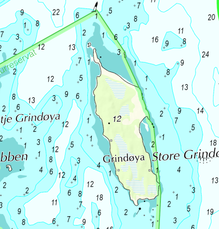
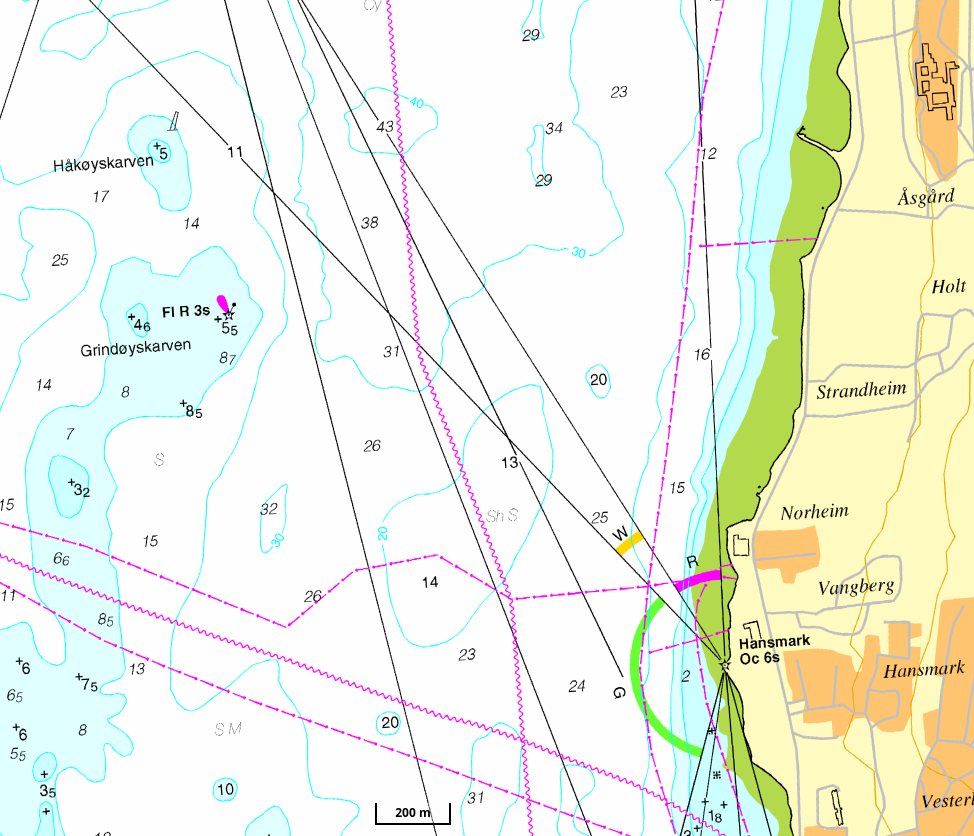

class: centre, middle

# Julebord 2023

## TSI Trulle

---

class: centre, middle
# 1. How many active members are there in Trulle?

353 according to NIF

---

class: centre, middle
# 2. Which lights are legally required for a kayak in the dark?

None. But is recommended to have a white light and a flash light.

---

class: centre, middle
# 3. How many boats can you choose from when going on water?

24

---

class: centre, middle
# 4. Where were the first kayaks developed?

Greenland

---

class: centre, middle
# 5. How many m/s is wind of Beaufort 5?

353

---

class: centre, middle
# 6. How many km is Tromsøya rundt?

24 km

---

class: centre, middle
# 7. What do the different colours of a light house mean?

Nothing by itself. You have to use a map to figure out which sector is safe.

---

class: centre, middle
# 8. How much is the fee every member has to pay for the drysuit rental?

50,- NOK

---

class: centre, middle
# 9. Which seakayaking courses do exist in the Norwegian paddle association?

1. Basic course
2. Technique course
3. Activity leader course
4. Videregåendekurs
5. Veilederkurs

---

class: centre, middle
# 10. How many double kayaks can you find in the shed?

2

---

class: centre, middle
# 11. Which bus stop is closest to the boat shed?

Sjølund

---

class: centre, middle
# 12. What kind of boat do you see here and in which way is it traveling?

Motor boat (under 50 m) travelling in your direction

---

class: centre, middle
# 14. When are you allowed to travel on Store Grindøya?

	1. July - 30. April

---

class: centre, middle
# 15. What equipment should you bring onto every trip?
	
- Flotation vest
- Communication device
- Spare clothing
- Snacks and water
- Map & compass
- Paddle float
- Spare paddle
- Pump
- (Dry suits)

---

class: centre, middle
# 16. What does __Fl R 3s__ on a nautical chart mean?

__Fl__ashing __R__ed light every __3s__

