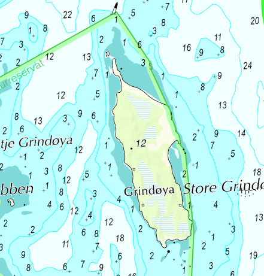
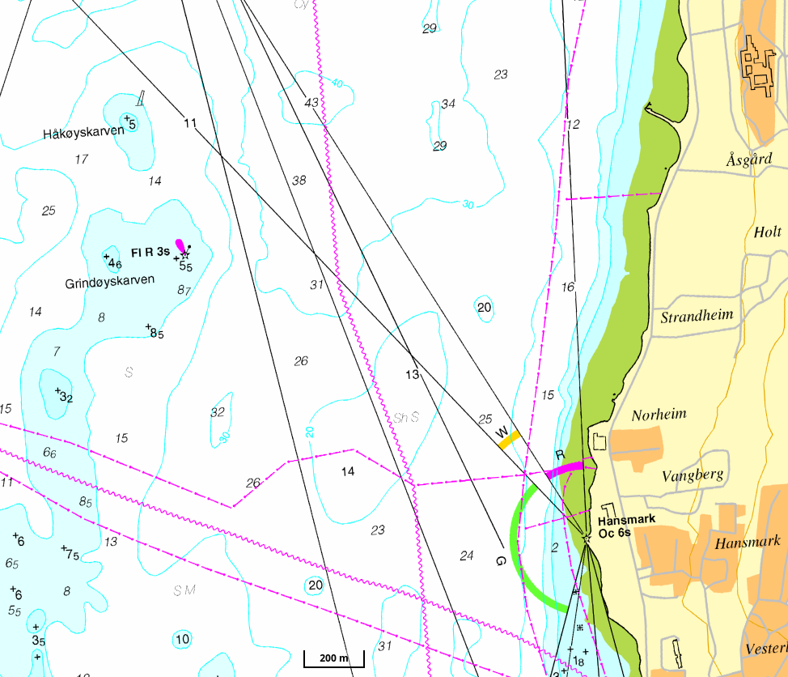

class: centre, middle

# Julebord 2023

## TSI Trulle

---

class: centre, middle
# 1. How many active members are there in Trulle?

---

class: centre, middle
# 2. Which lights are legally required for a kayak in the dark?

---

class: centre, middle
# 3. How many boats can you choose from when going on water?

---

class: centre, middle
# 4. Where were the first kayaks developed?

---

class: centre, middle
# 5. How many m/s is wind of Beaufort 5?

---

class: centre, middle
# 6. How many km is Tromsøya rundt?

---

class: centre, middle
# 7. What do the different colours of a light house mean?

---

class: centre, middle
# 8. How much is the fee every member has to pay for the drysuit rental?

---

class: centre, middle
# 9. Which seakayaking courses do exist in the Norwegian paddle association?

---

class: centre, middle
# 10. How many double kayaks can you find in the shed?

---

class: centre, middle
# 11. Which bus stop is closest to the boat shed?

---

class: centre, middle
# 12. What kind of boat do you see here and in which way is it traveling?

---

class: centre, middle
# 14. When are you allowed to travel on Store Grindøya?

---

class: centre, middle
# 15. What equipment should you bring onto every trip?

---

class: centre, middle
# 16. What does __FI R 3s__ on a nautical chart mean?

---
